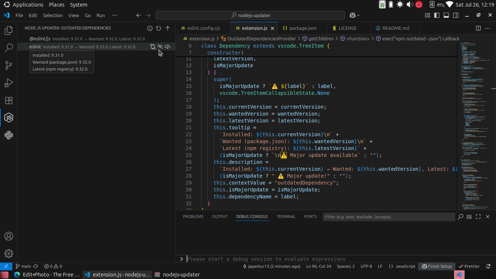

<p align="center">

<p align="center">
 
<h3 align="center"><b>🧩 Node.js Package Updater – VS Code Extension</b>
</h3>
</p>
</p>

A simple and effective Visual Studio Code extension to check and update outdated **Node.js (npm)** dependencies right inside the editor. Stay up-to-date, avoid breaking changes, and keep your code fresh with just a few clicks!

## ⚠️ Warning

- Please make a backup or something of your package.json and lock file,if anything goes wrong it will help you restore.Sometimes double check dependency version by hovering,because at last its just a small tool.

## ✨ Features

- 📦 Detect outdated dependencies in your project
- 🚨 Highlights **major version updates**
- 📋 View installed, wanted, and latest versions
- 🔄 One-click **update** for individual packages
- ✅ "Update All" feature with confirmation
- 🔗 Open package changelog on npm
- 🆘 In-app help with version explanation
- 🖼️ Activity bar icon (light/dark theme support)

---

## 📸 Screenshots


> Options for refresh,update all,help,single update and more
---

## 🚀 Getting Started

### 1. Install the extension

Download from the VS Code Marketplace from link provided or using `ext install JayantNavrange.nodejs-package-updater`

### 2. Open a Node.js project

Make sure your project has a `package.json` and run `npm install` once.

### 3. Use the command palette

- `> Nodejs Updater: Refresh Dependencies`  
  Checks for outdated packages

- `> Nodejs Updater: Show Help`  
  Shows info on version meanings

---

## 📖 Explanation

- Installed: Version currently in node_modules
- Wanted: Version that matches package.json semver
- Latest: Actual latest version on npm registry
  ⚠️ Major version updates may introduce breaking changes

## 🛠️ Commands

| Command                              |                      Description                      |
| :----------------------------------- | :---------------------------------------------------: |
| nodejs-updater.refreshDependencies   |          Refreshes outdated dependency list           |
| nodejs-updater.updateDependency      |              Updates a single dependency              |
| nodejs-updater.updateAllDependencies | Updates all outdated dependencies (with confirmation) |
| nodejs-updater.ignoreDependency      |                Skip specific packages (N/A)           |
| nodejs-updater.openChangelog         |            Opens npm page of a dependency             |
| nodejs-updater.showHelp              |             Shows explanation of versions             |

## 📂 File Structure

```
nodejs-updater/
├── extension.js             # Main extension logic
├── package.json             # Extension manifest
├── assets/
│   ├── mono.svg             # Activity bar icon (monochrome)
│   ├── main.png             # Store icon
```

## Changelog

See all the changes here in [Changelog](https://github.com/jayantur13/nodejs-package-updater/blob/main/CHANGELOG.md)

## Contributing

Contributions are always welcome!

See [Contributing.md](https://github.com/jayantur13/nodejs-package-updater/blob/main/CONTRIBUTING.md) for ways to get started.

Please adhere to this project's [Code Of Conduct](https://github.com/jayantur13/nodejs-package-updater/blob/main/CODE_OF_CONDUCT.md).

## Support the project

Want to support? [Sponsor me](https://github.com/sponsors/jayantur13).

## License

This project/extension is licensed under [MIT License](https://github.com/jayantur13/nodejs-package-updater/blob/main/LICENSE)
